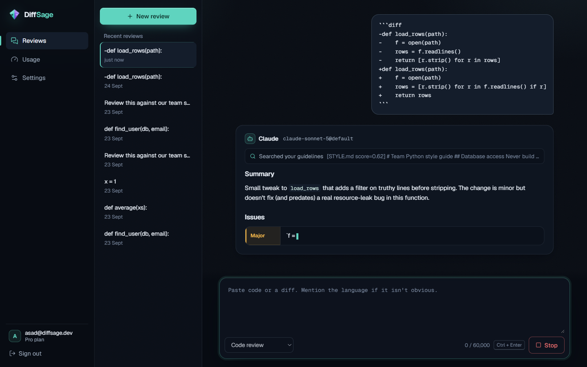
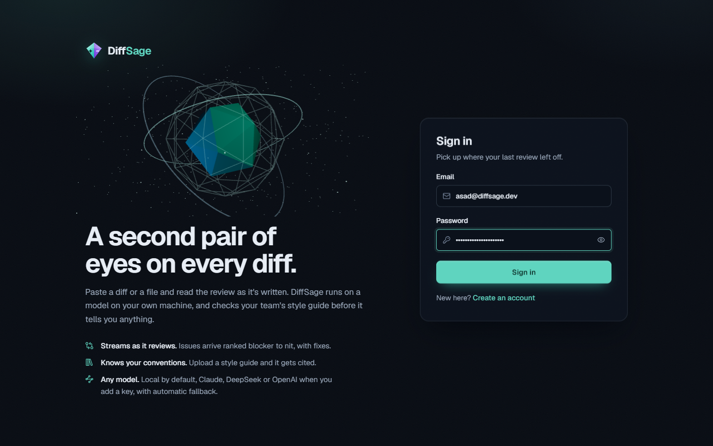
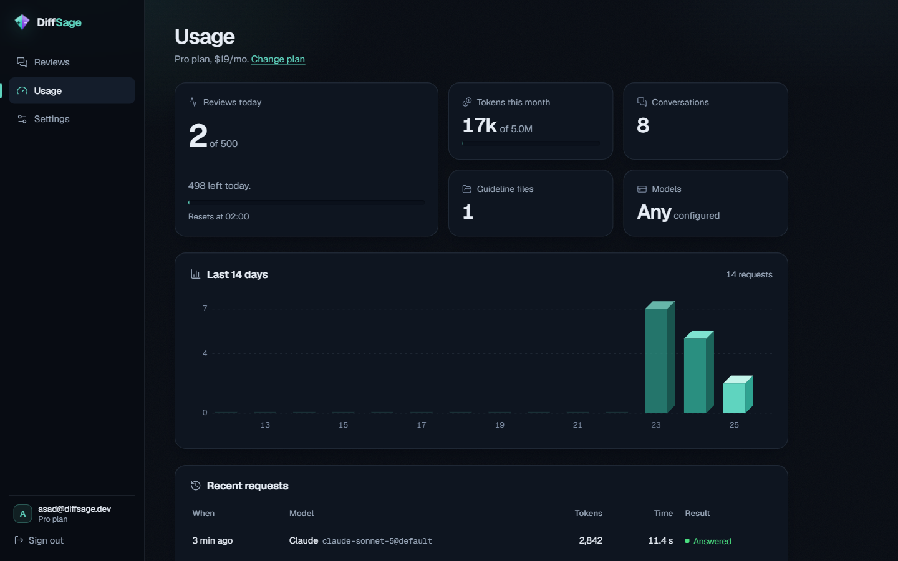
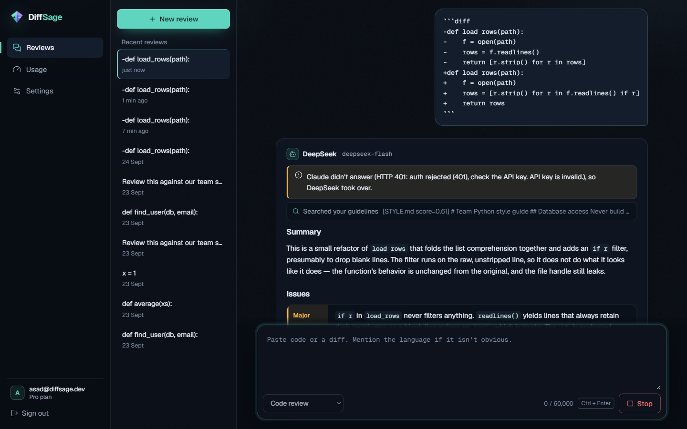
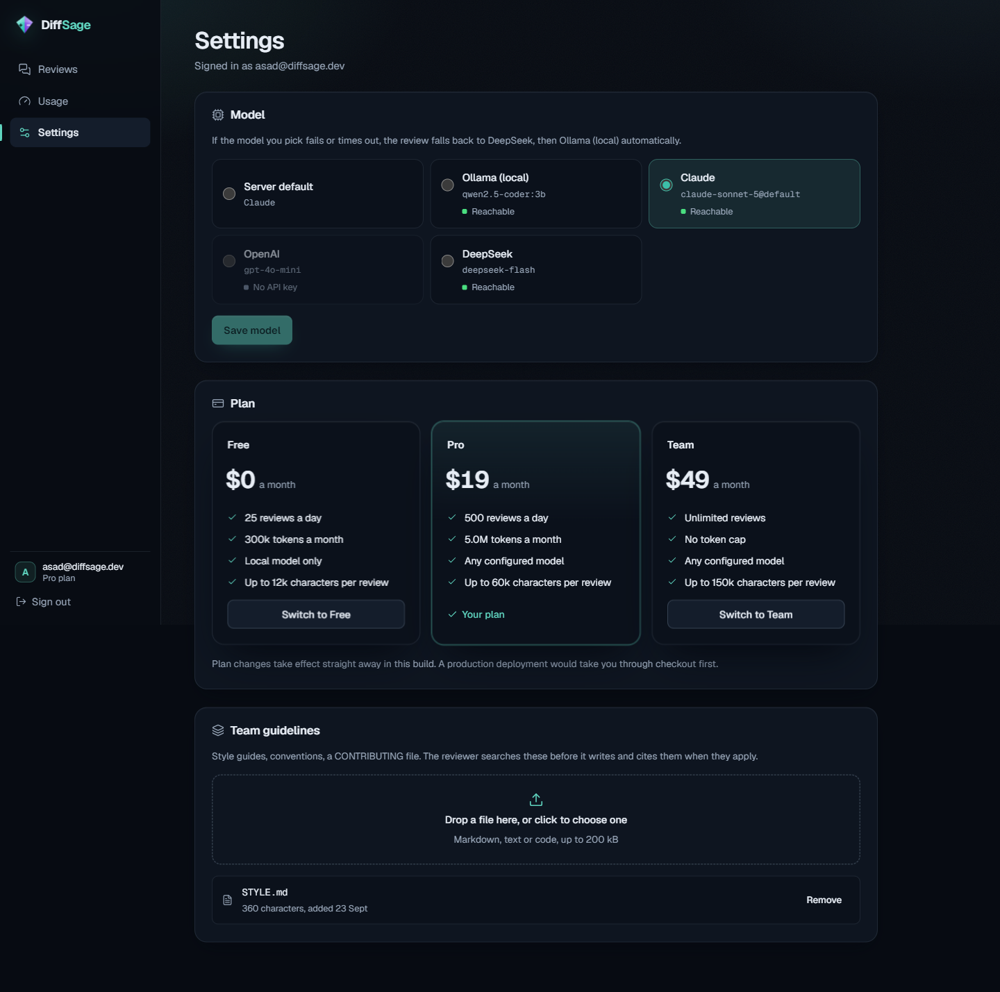
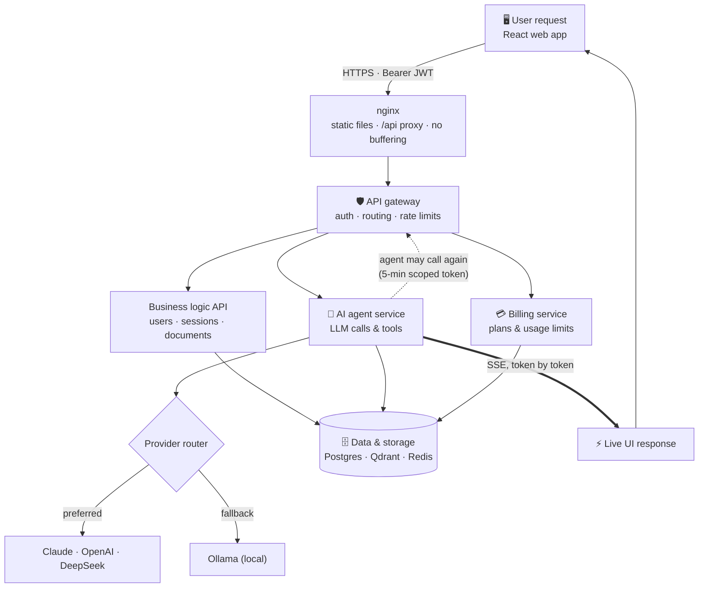

<p align="center">
  
</p>

<p align="center">
  <b>Self-hosted AI code review.</b> Paste a diff, watch the review stream in, get your team's own guidelines cited back at you.<br/>
  Runs on a local model by default; bring Claude, OpenAI or DeepSeek when you want. If a paid model fails, it falls back on its own.
</p>

<p align="center">
  <a href="https://skillicons.dev"></a>
</p>

<p align="center">
  
  
  
  
  
  
  
  
  
</p>



<table>
  <tr>
    <td><br/><sub>Sign-in with the three.js crystal</sub></td>
    <td><br/><sub>Usage dashboard with the isometric chart</sub></td>
  </tr>
  <tr>
    <td><br/><sub>Claude fails, DeepSeek takes over, and the UI says why</sub></td>
    <td><br/><sub>Model choice with live health, plans, guidelines</sub></td>
  </tr>
</table>

---

## Contents

- [What it is](#what-it-is)
- [Architecture](#architecture)
- [The seven layers](#the-seven-layers)
- [Quick start on Windows](#quick-start-on-windows)
- [Quick start on macOS / Linux](#quick-start-on-macos--linux)
- [Using it](#using-it)
- [Configuration](#configuration)
- [Project layout](#project-layout)
- [Tests and CI](#tests-and-ci)
- [More docs](#more-docs)

## What it is

DiffSage is a small but complete GenAI SaaS: login, a usage dashboard, a streaming chat UI, plans with quotas, and an agent that can look things up before it answers. The default use case is code review. The same agent loop also ships as a **research assistant** and a **support bot** (`backend/app/agent/profiles.py`); switching use case is a new profile, not new plumbing.

| | |
| --- | --- |
| **Streaming** | Token-by-token over Server-Sent Events, rendered live as Markdown with a severity gutter for issues and real diff highlighting. |
| **Any model** | One provider interface. Ollama, Claude, OpenAI and DeepSeek ship in the box; any OpenAI-compatible API is a config table, not code. |
| **Fallback** | If the chosen model errors, has no key, or doesn't start answering in time, the request moves to Ollama and the UI says so. |
| **RAG** | Upload a style guide. It's chunked, embedded, stored in Qdrant per user, and the agent searches it before reviewing. |
| **Billing** | Free / Pro / Team plans with daily request caps, monthly token caps, input size limits and per-plan model access. |
| **Real health** | `/api/health` actually pings Postgres, Redis, Qdrant and every configured model provider. |

## Architecture

It follows the classic GenAI SaaS flow one-to-one: **User request → API gateway → (Business logic API · AI agent service · Billing service) → Data & storage → Live UI response**, with the agent allowed to call back into the gateway.



A full walkthrough (request path, sequence diagram, schema, auth, health, streaming) is in **[docs/architecture.md](docs/architecture.md)**.

## The seven layers

| # | Layer | Where | What it does |
| --- | --- | --- | --- |
| 1 | **User request** | `frontend/` | React 19 + Vite. Sign in, dashboard, streaming chat, settings. Access token in memory, refresh token in an httpOnly cookie. The 3D sign-in scene is three.js, lazy-loaded. |
| 2 | **API gateway** | `backend/app/gateway/` | Pure ASGI middleware (streaming-safe). A route table maps every `/api` prefix to a service, checks JWTs, blocks agent tokens from anything but two read-only routes, and applies fixed-window rate limits in Redis with `X-RateLimit-*` headers. |
| 3 | **Business logic API** | `backend/app/services/business/` | Register/login/refresh/logout with rotating refresh tokens and reuse detection, conversations, messages, guideline uploads. |
| 4 | **AI agent service** | `backend/app/services/agent/`, `backend/app/agent/` | Validates everything *before* the stream opens, then runs the agent loop: stream a turn, run requested tools through the gateway, repeat (bounded). The provider router picks the model and handles fallback. |
| 5 | **Billing service** | `backend/app/services/billing/` | Plans as code, synced to Postgres at startup. Quota checks (402), plan checks (403), usage recorded on every request, including cancelled ones. |
| 6 | **Data & storage** | `backend/app/db/`, `cache/`, `vectorstore/` | Postgres (SQLAlchemy 2 async + Alembic), Redis for rate limits and quota snapshots, Qdrant for embeddings filtered per user. |
| 7 | **Live UI response** | `frontend/src/api/sse.js`, `pages/Chat.jsx` | `fetch` + a streaming SSE parser (EventSource can't POST or send auth headers). Tokens render as they arrive; tool calls and fallbacks show up inline. |

## Quick start on Windows

You need **Docker Desktop** (with WSL 2) and about **8 GB of free disk** for the models. Everything else runs in containers. Open **PowerShell** in the project folder:

```powershell
# 1. one-time: allow local scripts for your user
Set-ExecutionPolicy -Scope CurrentUser RemoteSigned

# 2. create .env with a random JWT secret
.\diffsage.ps1 setup

# 3. build, start, wait until healthy, open the browser
.\diffsage.ps1 up
```

The first start pulls the chat model and `nomic-embed-text` into the Ollama container, which takes a few minutes. Then:

| What | URL |
| --- | --- |
| App | http://localhost:8080 |
| Health report | http://localhost:8000/api/health |
| API docs (dev only) | http://localhost:8000/docs |

Other commands: `.\diffsage.ps1 logs`, `health`, `down`, `test`, `lint`. Run `.\diffsage.ps1` with no arguments for the full list.

> **Port 8080 or 8000 taken?** (`ports are not available`) Add `WEB_PORT=8088` and/or `API_PORT=8001` to `.env` and run `up` again. The script picks both up.
>
> **Laptop without an NVIDIA GPU?** Put `OLLAMA_MODEL=qwen2.5-coder:3b` in `.env` before `up`. The 7B default is noticeably better but slow on CPU. Be realistic about speed: on a 4-core laptop CPU inside Docker, a local model writes about **1–3 tokens per second**, so a full review takes a few minutes (it streams the whole time). For snappy reviews, add a Claude/OpenAI/DeepSeek key, or run on an NVIDIA GPU by uncommenting the `deploy:` block under `ollama` in `docker-compose.yml`.

Step-by-step instructions, including running without Docker and troubleshooting, are in **[docs/windows-setup.md](docs/windows-setup.md)**.

## Quick start on macOS / Linux

```bash
cp .env.example .env
python3 -c "import secrets; print('JWT_SECRET=' + secrets.token_urlsafe(48))" >> .env
docker compose up --build
```

`make up`, `make test`, `make infra`, `make dev-backend` and `make dev-frontend` do the same as their PowerShell counterparts.

## Using it

1. **Create an account.** New accounts are on the Free plan: 25 reviews a day, local model only.
2. **Paste code or a diff** into the composer (or click one of the starter cards) and press **Review** or `Ctrl + Enter`. The review streams in; **Stop** cancels it.
3. **Upload guidelines** in Settings → Team guidelines. The reviewer searches them before it writes and cites the file when a rule applies.
4. **Switch plans** in Settings to try Pro or Team. The self-serve switch is a stand-in for real checkout and is turned off with `BILLING__ALLOW_SELF_SERVE_PLAN_CHANGE=false`.
5. **Pick a model** in Settings (Pro and Team). Providers without a key show as "No API key" and stay disabled.

### Using paid models

Add any of these to `.env`, then `.\diffsage.ps1 up` again (or `docker compose up -d backend`):

```dotenv
ANTHROPIC_API_KEY=sk-ant-...
OPENAI_API_KEY=sk-...
DEEPSEEK_API_KEY=sk-...
```

Keys are only read from the environment. To make a paid model the default for everyone: `AGENT__DEFAULT_PROVIDER=anthropic`. If it errors or doesn't produce a first token within `agent.first_token_timeout_seconds`, the request falls back to `agent.fallback_provider` (Ollama by default; an ordered list like `AGENT__FALLBACK_PROVIDER=deepseek,ollama` works too, and plans skip providers they don't include) and the UI shows a notice.

### Already running Ollama on the host?

```dotenv
OLLAMA_BASE_URL=http://host.docker.internal:11434
```

Then `ollama pull qwen2.5-coder:7b` and `ollama pull nomic-embed-text` on the host.

## Configuration

Defaults live in `backend/config/settings.toml`. Any value can be overridden with an environment variable that spells out its path with double underscores:

| Setting | Env var |
| --- | --- |
| `[agent] default_provider` | `AGENT__DEFAULT_PROVIDER` |
| `[agent] first_token_timeout_seconds` | `AGENT__FIRST_TOKEN_TIMEOUT_SECONDS` |
| `[rate_limits] agent.limit` | `RATE_LIMITS__AGENT__LIMIT` |
| `[providers.ollama] model` | `PROVIDERS__OLLAMA__MODEL` (or `OLLAMA_MODEL` via compose) |

Secrets (`JWT_SECRET`, `DATABASE_URL`, `REDIS_URL`, `QDRANT_URL`, `<PROVIDER>_API_KEY`) only come from the environment. With `APP__ENVIRONMENT=production` the app refuses to start with a placeholder JWT secret or the default database password.

## Project layout

```
diffsage/
├── backend/
│   ├── app/
│   │   ├── gateway/          # layer 2: route table, auth check, rate limits (ASGI)
│   │   ├── services/
│   │   │   ├── business/     # layer 3: auth, users, sessions, documents
│   │   │   ├── agent/        # layer 4: /api/agent/chat + the SSE stream
│   │   │   ├── billing/      # layer 5: plans, quotas, usage history
│   │   │   └── health/       # real checks for every component
│   │   ├── agent/            # the agent loop, tools, profiles
│   │   │   └── providers/    # one file per model API + registry + fallback router
│   │   ├── db/ cache/ vectorstore/   # layer 6
│   │   └── core/             # config, logging, errors, security
│   ├── alembic/              # migrations
│   ├── config/settings.toml  # non-secret defaults
│   └── tests/                # 121 tests, no services needed
├── frontend/
│   └── src/
│       ├── api/              # fetch client + streaming SSE parser (layer 7)
│       ├── components/       # 3D hero, tilt cards, markdown, charts
│       └── pages/            # Login, Dashboard, Chat, Settings
├── docs/                     # architecture, Windows setup, providers, design, review report
├── .claude/                  # project context + skills for Claude Code (run, agent loop, providers, UI, ship check)
├── docker-compose.yml        # the whole stack, one command
├── docker-compose.dev.yml    # publishes the data stores on localhost for host dev
├── diffsage.ps1              # Windows task runner
└── Makefile                  # the same, for macOS/Linux
```

## Tests and CI

```powershell
.\diffsage.ps1 deps   # once
.\diffsage.ps1 test   # pytest (121) + vitest (9)
.\diffsage.ps1 lint
```

The backend tests run the real FastAPI app in-process with SQLite, in-memory stand-ins for Redis and Qdrant, and scripted fake models, so they need no services. They cover auth (including refresh-token reuse), the gateway's 401/404/429 handling, streaming, quotas (402), plan rules (403), provider switching, fallback, mid-stream failures, the agent's tool calls going back through the gateway, and health checks with components deliberately broken.

CI (`.github/workflows/ci.yml`) lints and tests both halves, applies the migrations up/down/up against a real Postgres, and builds both Docker images.

## More docs

| Doc | For |
| --- | --- |
| [docs/architecture.md](docs/architecture.md) | How a request flows, sequence and ER diagrams, auth, health, streaming |
| [docs/windows-setup.md](docs/windows-setup.md) | Detailed Windows setup, running without Docker, troubleshooting |
| [docs/adding-a-provider.md](docs/adding-a-provider.md) | Plugging in another model API |
| [docs/design.md](docs/design.md) | The design system: tokens, type, 3D moments, accessibility |
| [docs/code-review-report.md](docs/code-review-report.md) | The full review of this codebase: bugs found, what was fixed, health check results |

## Known limits

- One uvicorn worker per container; scale with more containers. Rate limits and caches already live in Redis, so they're shared.
- The daily quota is checked when a request starts and recorded when it ends, so a user firing several streams at the same moment can overshoot the cap by a few requests. The agent rate limit (20/min) bounds it.
- Plan changes are self-serve in dev. A real deployment would put Stripe Checkout in front of `POST /api/billing/plan` and flip the plan in the webhook.
- Uploaded guidelines are text only (Markdown, code, plain text), up to 200k characters each.

## License

MIT. See [LICENSE](LICENSE).
