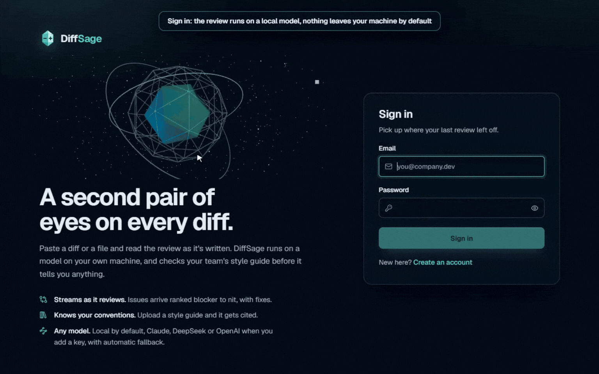
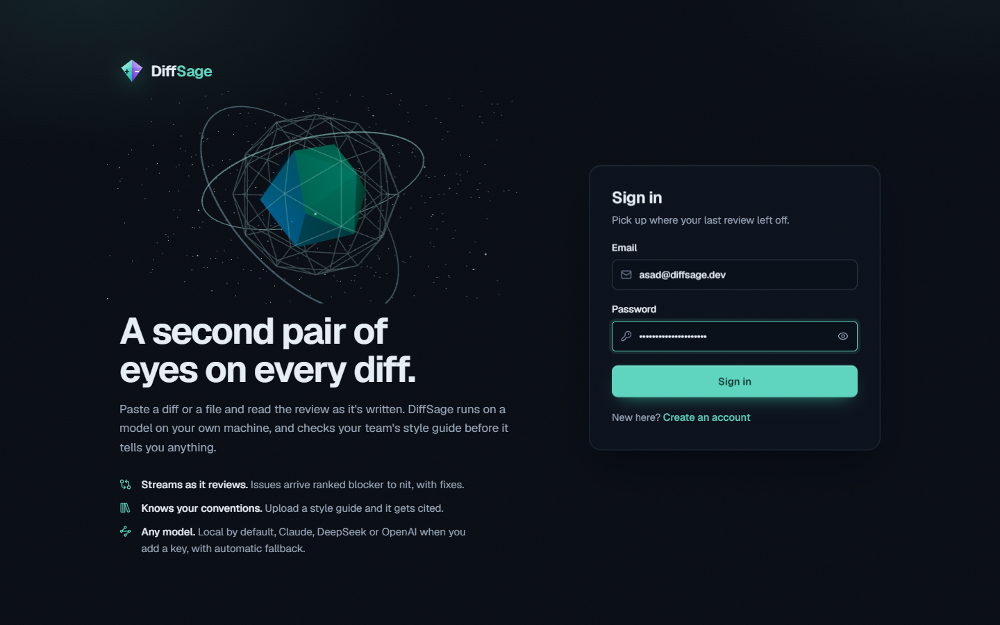
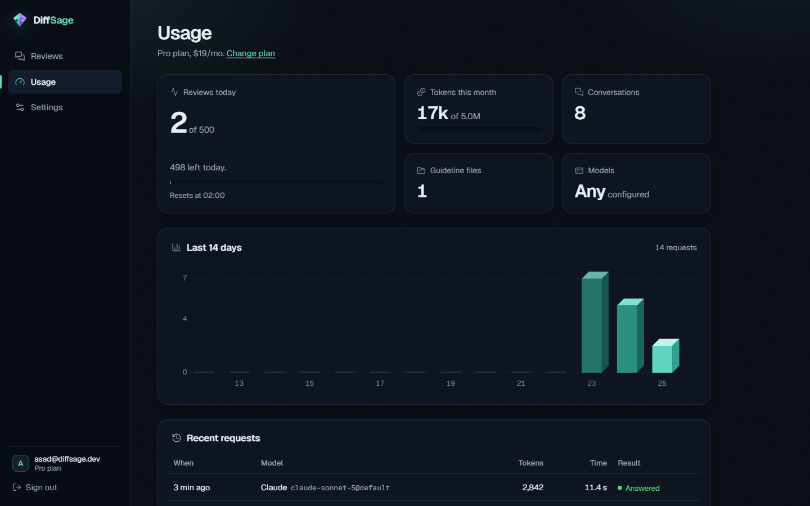
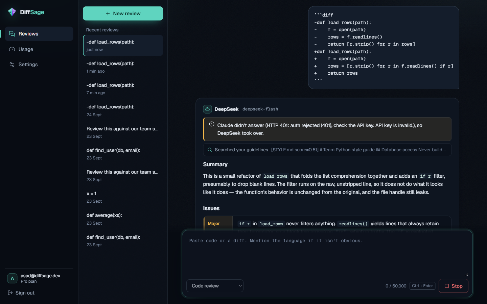
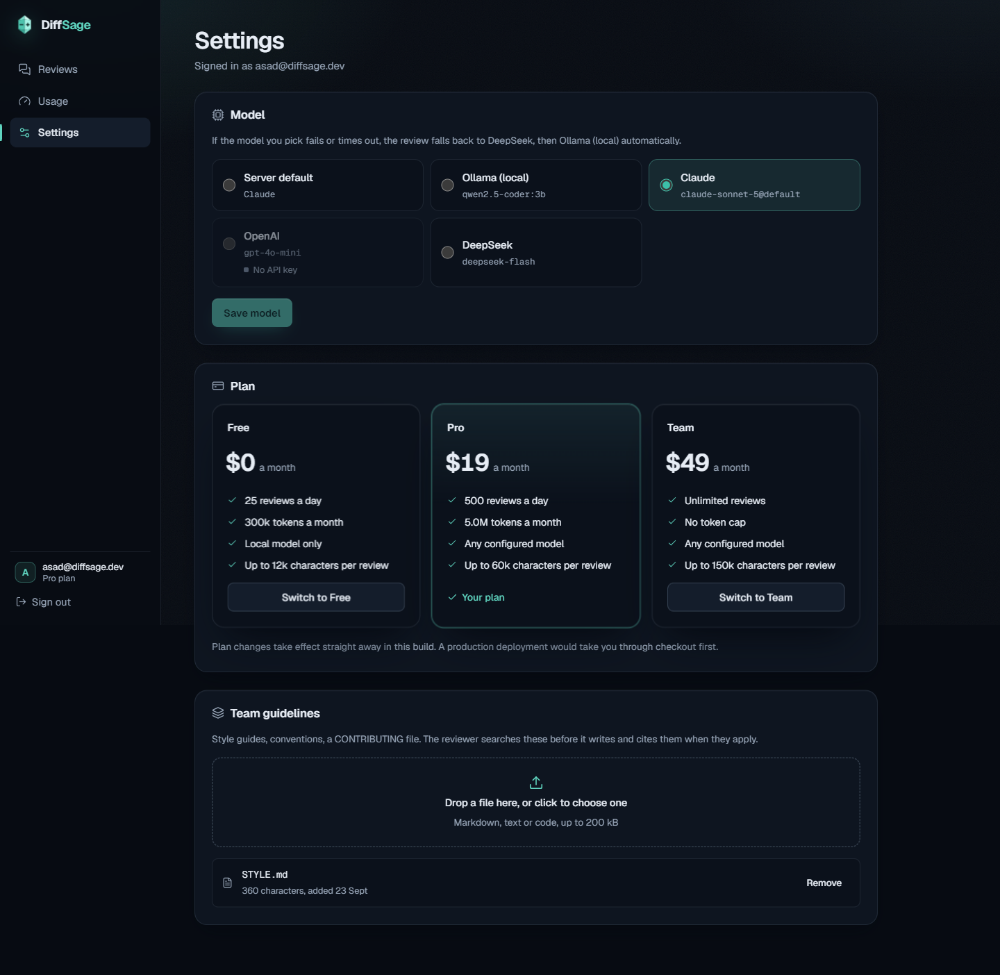

<p align="center">
  
</p>

<p align="center">
  <b>Self-hosted AI code review.</b> Paste a diff, watch the review stream in, and get your team's own guidelines cited back at you.<br/>
  Runs on a local Ollama model by default, with DeepSeek (or OpenAI, or Claude) as the fallback when you add a key. If a model fails, the next one takes over.
</p>

<p align="center">
  <a href="https://github.com/asadaslam556/diffsage/actions/workflows/ci.yml"></a>
  
  
  
</p>

<p align="center">
  
  
  
  
  
  
  
</p>

<p align="center">
  
  
  
  
  
  
  
  
</p>

<p align="center">
  
  <br/><sub>Sign in, pick a model, upload a style guide, review a diff, check usage. <a href="docs/assets/demo.mp4">Full-quality video (MP4)</a></sub>
</p>

<table>
  <tr>
    <td><br/><sub>Sign-in with the three.js crystal</sub></td>
    <td><br/><sub>Usage dashboard with the isometric chart</sub></td>
  </tr>
  <tr>
    <td><br/><sub>A model fails, the next one takes over, and the UI says why</sub></td>
    <td><br/><sub>Model choice with live health, plans, guidelines</sub></td>
  </tr>
</table>

## Contents

- [What it does](#what-it-does)
- [Architecture](#architecture)
- [Quick start on Windows](#quick-start-on-windows)
- [Quick start on macOS / Linux](#quick-start-on-macos--linux)
- [Running the code on the host](#running-the-code-on-the-host)
- [Using it](#using-it)
- [Configuration](#configuration)
- [Project layout](#project-layout)
- [Tests and CI](#tests-and-ci)
- [Troubleshooting](#troubleshooting)
- [Known limits](#known-limits)
- [Security](#security)
- [Author](#author) · [License](#license)

## What it does

DiffSage is a complete, self-hosted GenAI app: sign-in, a streaming review chat, a usage dashboard, plans with quotas, and an agent that looks things up before it answers. Code review is the default; the same agent loop also runs as a **research assistant** and a **support bot** (`backend/app/agent/profiles.py`).

| | |
| --- | --- |
| **Streaming** | Token-by-token over Server-Sent Events, rendered as Markdown with a severity gutter (`blocker` / `major` / `minor` / `nit`) and real diff highlighting. |
| **Any model** | One provider interface. Ollama, DeepSeek, OpenAI and Claude ship in the box; any OpenAI-compatible API is a settings table, not code. |
| **Fallback** | If a model errors, has no key, or sends nothing within 25 s, the request moves to the next provider in the fallback chain and the UI says why. |
| **Guidelines (RAG)** | Upload a style guide. It's chunked, embedded by Ollama, stored per user in Qdrant, and the agent searches it before reviewing. |
| **Plans and quotas** | Free / Pro / Team with daily request caps, monthly token caps, input size limits and per-plan model access, all checked before a stream opens. |
| **Security** | PBKDF2 passwords, rotating refresh tokens with reuse detection, per-IP and per-account sign-in limits, and a strict Content Security Policy. |
| **Real health** | `/api/health` pings Postgres, Redis, Qdrant and every configured model provider. |

## Architecture

<p align="center"></p>

A request goes through **nginx** to the **API gateway**, which checks the route, the token and the rate limit. Then one of three services handles it, reading and writing the data stores, and the answer streams back to the browser. When the agent needs to look something up, it calls back into the same gateway with a short-lived token.

| # | Layer | Where | What it does |
| --- | --- | --- | --- |
| 1 | **Web app** | `frontend/` | React 19 + Vite. Access token in memory, refresh token in an HttpOnly cookie. The 3D sign-in scene is three.js, lazy-loaded. |
| 2 | **API gateway** | `backend/app/gateway/` | Pure ASGI middleware (streaming-safe). Route table, JWT check, agent-token scope, Redis rate limits with `X-RateLimit-*` headers. |
| 3 | **Business API** | `backend/app/services/business/` | Sign-up, sign-in, refresh, sign-out; conversations; guideline uploads and search. |
| 4 | **Agent service** | `backend/app/services/agent/`, `backend/app/agent/` | Rejects bad requests before the stream opens, then runs the agent loop and streams the reply. |
| 5 | **Billing** | `backend/app/services/billing/` | Plans as code, quota checks (402 / 403 / 422), usage recorded for every run, including stopped ones. |
| 6 | **Data** | `backend/app/db/`, `cache/`, `vectorstore/` | Postgres (SQLAlchemy 2 async + Alembic), Redis for limits and usage snapshots, Qdrant for guideline vectors. |
| 7 | **Live response** | `frontend/src/api/sse.js` | `fetch` + a streaming SSE parser (EventSource can't POST or send auth headers). |

Every flow, with diagrams of the gateway, a full review, the agent loop, fallback, guidelines, usage, sign-in, the data model and deployment, is in **[docs/architecture.md](docs/architecture.md)**.

## Quick start on Windows

  

You need **Docker Desktop** (WSL 2 backend, with at least 6 GB of memory) and about **8 GB of free disk** for the models. Open **PowerShell** in the project folder:

```powershell
git clone https://github.com/asadaslam556/diffsage.git
cd diffsage

# 1. once: allow local scripts for your user
Set-ExecutionPolicy -Scope CurrentUser RemoteSigned

# 2. create .env with a random JWT secret
.\diffsage.ps1 setup

# 3. build, start, wait until healthy, open the browser
.\diffsage.ps1 up
```

The first start pulls the chat model and `nomic-embed-text` into the Ollama container, which takes a few minutes (`docker compose logs -f ollama-pull` shows progress).

| What | URL |
| --- | --- |
| App | http://localhost:8080 |
| Health report | http://localhost:8000/api/health |
| API docs (not in production) | http://localhost:8000/docs |

| Command | Does |
| --- | --- |
| `.\diffsage.ps1 setup` | Creates `.env` from `.env.example` with a random 64-character `JWT_SECRET` |
| `.\diffsage.ps1 up` | Builds and starts all services, waits for the API, opens the browser |
| `.\diffsage.ps1 health` | Prints the full health report |
| `.\diffsage.ps1 logs` | Follows the backend logs |
| `.\diffsage.ps1 down` | Stops everything (data stays in Docker volumes; `docker compose down -v` wipes accounts and models too) |
| `.\diffsage.ps1 deps` | Creates `backend\.venv` and installs backend + frontend dependencies |
| `.\diffsage.ps1 infra` | Starts only Postgres, Redis, Qdrant and Ollama, for host development |
| `.\diffsage.ps1 dev-backend` | Runs migrations, then the API on :8000 with reload |
| `.\diffsage.ps1 dev-frontend` | Runs Vite on :5173 |
| `.\diffsage.ps1 test` | Backend and frontend tests |
| `.\diffsage.ps1 lint` | `ruff check` on the backend |

> **Laptop without an NVIDIA GPU?** Put `OLLAMA_MODEL=qwen2.5-coder:3b` in `.env` before `up`. The 7B default is better but slow on a CPU: expect about 1-3 tokens per second, so a local review takes a few minutes (it streams the whole time). For fast reviews add a DeepSeek (or OpenAI) key, or give Ollama an NVIDIA GPU by uncommenting the `deploy:` block in `docker-compose.yml`.

## Quick start on macOS / Linux

  

```bash
git clone https://github.com/asadaslam556/diffsage.git && cd diffsage
make up
```

`make up` creates `.env` with a random `JWT_SECRET` on the first run (`make setup` does only that). `make health`, `make down`, `make logs`, `make deps`, `make infra`, `make dev-backend`, `make dev-frontend`, `make test` and `make lint` match the PowerShell commands above.

## Running the code on the host

<p align="center"></p>

For hot reload you also need **Python 3.11+** and **Node 22**. Start the data stores in Docker (published on `127.0.0.1` only), then the API and the UI in two terminals:

```powershell
.\diffsage.ps1 deps
.\diffsage.ps1 infra
.\diffsage.ps1 dev-backend    # terminal 1: http://localhost:8000
.\diffsage.ps1 dev-frontend   # terminal 2: http://localhost:5173 (proxies /api to :8000)
```

## Using it

The demo at the top shows each of these steps.

1. **Create an account.** New accounts are on the Free plan: 25 reviews a day, local model only.
2. **Paste code or a diff** (or click a starter card) and press **Review** or `Ctrl + Enter`. The review streams in; **Stop** cancels it.
3. **Upload guidelines** in Settings → Team guidelines (Markdown, code or text, up to 200 kB). The reviewer searches them and cites the file when a rule applies.
4. **Switch plans** in Settings to try Pro or Team. Self-serve switching is for local use; the app refuses to start with it on in production.
5. **Pick a model** in Settings (Pro and Team). Providers without a key show "No API key" and stay disabled.

### Paid models and gateways

Add keys to `.env`, then run `.\diffsage.ps1 up` again (or `docker compose up -d backend`):

```dotenv
DEEPSEEK_API_KEY=<YOUR_DEEPSEEK_KEY>

# reviews run on the local model; DeepSeek takes over if it fails or is slow to start
AGENT__DEFAULT_PROVIDER=ollama
AGENT__FALLBACK_PROVIDER=deepseek

# optional: other DeepSeek model, or more first-token time for a CPU-only machine
PROVIDERS__DEEPSEEK__MODEL=deepseek-flash
AGENT__FIRST_TOKEN_TIMEOUT_SECONDS=25
```

Fallbacks a user's plan doesn't include are skipped, so Free users stay on the local model. `OPENAI_API_KEY` and `ANTHROPIC_API_KEY` work the same way, and the fallback can be an ordered list such as `deepseek,openai`. Any OpenAI-compatible API can be added as well; see [Adding a provider](docs/architecture.md#adding-a-provider).

### An Ollama already running on your machine

```dotenv
OLLAMA_BASE_URL=http://host.docker.internal:11434
```

Then run `ollama pull qwen2.5-coder:7b` and `ollama pull nomic-embed-text` on the host.

## Configuration

Non-secret defaults live in `backend/config/settings.toml`. Any value can be overridden with an environment variable that spells out its path with double underscores, for example `RATE_LIMITS__AGENT__LIMIT=40` or `PROVIDERS__OLLAMA__MODEL=llama3.1:8b`.

| Variable | Used for |
| --- | --- |
| `JWT_SECRET` | Signing access tokens (32+ characters; required in production) |
| `DEEPSEEK_API_KEY`, `OPENAI_API_KEY`, `ANTHROPIC_API_KEY` | Hosted models (blank = "not configured") |
| `AGENT__DEFAULT_PROVIDER`, `AGENT__FALLBACK_PROVIDER` | Default provider (`ollama`) and the ordered fallback list (for example `deepseek`) |
| `AGENT__FIRST_TOKEN_TIMEOUT_SECONDS` | How long a provider gets to start answering before the next one takes over (25) |
| `OLLAMA_MODEL`, `OLLAMA_EMBED_MODEL`, `OLLAMA_BASE_URL` | Local chat model, embedding model, external Ollama |
| `OLLAMA_KEEP_ALIVE`, `OLLAMA_CONTEXT_LENGTH` | How long Ollama keeps the model loaded (24h) and its context window (8192) |
| `POSTGRES_USER`, `POSTGRES_PASSWORD`, `POSTGRES_DB` | Database credentials used by Compose |
| `DATABASE_URL`, `REDIS_URL`, `QDRANT_URL`, `QDRANT_API_KEY` | Connection settings when running the backend on the host |
| `WEB_PORT`, `API_PORT`, `OLLAMA_PORT` | Host ports (defaults 8080, 8000, 11434) |
| `APP_ENVIRONMENT` | `production` turns on the strict start-up checks |
| `BILLING__ALLOW_SELF_SERVE_PLAN_CHANGE` | Self-serve plan switching (must be off in production) |

With `APP_ENVIRONMENT=production` the app refuses to start with a placeholder JWT secret, the default database password, or self-serve plan changes turned on. Secrets only ever come from the environment, never from `settings.toml`. The full settings reference is in [docs/architecture.md](docs/architecture.md#configuration).

## Project layout

```
diffsage/
├── backend/
│   ├── app/
│   │   ├── gateway/            # route table, JWT check, agent scope, rate limits
│   │   ├── services/
│   │   │   ├── business/       # auth, users, sessions, guidelines
│   │   │   ├── agent/          # /api/agent/chat and the SSE stream
│   │   │   ├── billing/        # plans, quotas, usage history
│   │   │   └── health/         # real checks for every component
│   │   ├── agent/              # agent loop, tools, profiles
│   │   │   └── providers/      # one file per model API, registry, fallback router
│   │   ├── db/ cache/ vectorstore/
│   │   └── core/               # config, logging, errors, security
│   ├── alembic/                # migrations
│   ├── config/settings.toml    # non-secret defaults
│   └── tests/                  # 138 tests, no services needed
├── frontend/
│   └── src/
│       ├── api/                # fetch client + streaming SSE parser
│       ├── components/         # 3D hero, tilt cards, markdown, chart
│       └── pages/              # Login, Dashboard, Chat, Settings
├── docs/                       # architecture guide, diagrams, screenshots
├── docker-compose.yml          # the whole stack
├── docker-compose.dev.yml      # data stores on localhost for host dev
├── diffsage.ps1                # Windows task runner
└── Makefile                    # the same for macOS / Linux
```

## Tests and CI

     

```powershell
.\diffsage.ps1 deps   # once
.\diffsage.ps1 test   # pytest + vitest
.\diffsage.ps1 lint
```

The backend tests run the real FastAPI app in-process with SQLite, in-memory stand-ins for Redis and Qdrant, and scripted fake models, so they need no services. They cover auth (including refresh-token reuse, two tabs refreshing at once and the per-account sign-in limit), the gateway's 401 / 403 / 404 / 429 handling, streaming, quotas (including reviews still in flight), plan rules, provider fallback, mid-stream failures, the agent's tool calls through the gateway, and health checks with components broken on purpose.

CI (`.github/workflows/ci.yml`) lints and tests both halves, applies the migrations up, down and up again on a real Postgres, and builds both Docker images. CodeQL scans every push, and Dependabot opens weekly update PRs.

## Troubleshooting

| Symptom | Fix |
| --- | --- |
| `running scripts is disabled on this system` | `Set-ExecutionPolicy -Scope CurrentUser RemoteSigned`, or run `powershell -ExecutionPolicy Bypass -File .\diffsage.ps1 up` |
| `error during connect ... docker_engine` | Docker Desktop isn't running. Start it and wait for "Engine running". |
| `ports are not available` | Set `WEB_PORT`, `API_PORT` or `OLLAMA_PORT` in `.env` to free ports (for example 8088, 8001, 11435) and run `up` again. 11434 is often taken by the Windows Ollama app. |
| "None of the AI providers responded" | The model is still downloading (`docker compose logs ollama-pull`) or Docker has too little memory. Check `.\diffsage.ps1 health`. |
| Reviews are very slow | You're on CPU with a 7B model. Use `OLLAMA_MODEL=qwen2.5-coder:3b` or add a hosted model key. |
| Uploading a guideline fails with "Couldn't index the file" | `nomic-embed-text` isn't pulled yet. Wait for `ollama-pull` to finish. |
| `dev-backend` can't reach the database | Run `.\diffsage.ps1 infra` first. |
| Pro reviews keep moving to DeepSeek | The local model took longer than 25 s to start answering, which a CPU can on a long diff. Raise `AGENT__FIRST_TOKEN_TIMEOUT_SECONDS` in `.env`. Free plans have no fallback, so they always wait. |
| Signed out after restarting the backend | `JWT_SECRET` is empty, so each start makes a new one. `.\diffsage.ps1 setup` writes a stable one. |
| Every review is answered by the fallback model | The hosted model's key is wrong or expired. Replace it in `.env` and run `up` again; reviews fall back automatically until then. |

## Known limits

- One uvicorn worker per container; scale with more containers. Rate limits and caches already live in Redis.
- Reviews that are still streaming count against the daily quota (tracked in Redis). If a worker crashes mid-review, its slot frees up after 15 minutes.
- Plan changes are self-serve for local use. A hosted deployment would put checkout in front of `POST /api/billing/plan`.
- Sign-up says when an email is already registered, and there is no password reset; both need an email service.
- Guidelines are text only (Markdown, code, plain text), up to 200,000 characters each.
- Qdrant is pinned to 1.12.4: newer versions need a step-by-step upgrade of existing data, so it isn't bumped automatically.

## Security

Please report vulnerabilities privately as described in [SECURITY.md](SECURITY.md).

## Author

Built by **Asad Aslam** ([@asadaslam556](https://github.com/asadaslam556)).

## License

MIT © 2026 Asad Aslam. See [LICENSE](LICENSE).
