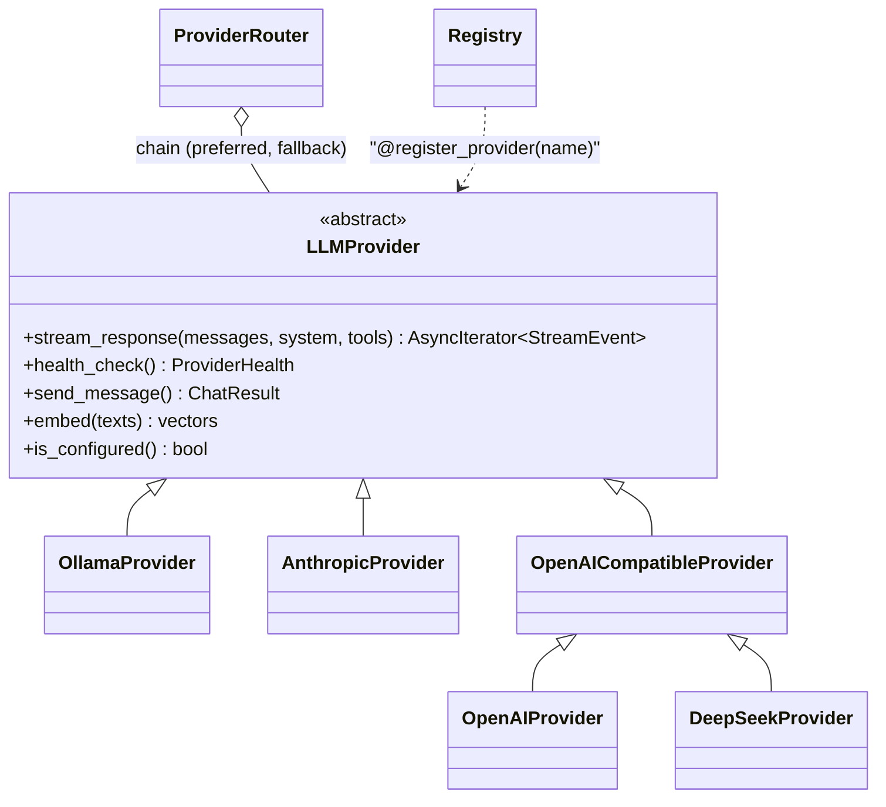

<p align="center">
  <br/>
  
  
  
  
</p>

# Adding a model provider



The router and the agent loop only ever see `LLMProvider`. Adding a provider never touches either of them.

## If it speaks the OpenAI chat completions API

Most do (Groq, Together, Mistral, OpenRouter, vLLM, LM Studio...). You don't write any code. Add a table to `backend/config/settings.toml`:

```toml
[providers.groq]
adapter = "openai_compatible"
base_url = "https://api.groq.com/openai/v1"
model = "llama-3.3-70b-versatile"
```

Then set `GROQ_API_KEY` in `.env` and restart. The table name is what users see in Settings and what `AGENT__DEFAULT_PROVIDER` refers to. It shows up in `/api/health` straight away.

## If it has its own API

Add one file in `backend/app/agent/providers/`. Modules there are imported automatically, except ones starting with `_`.

```python
from app.agent.providers._http import raise_for_status, iter_sse_data, timed_get, health_from_response, wrap_transport_error
from app.agent.providers.base import LLMProvider, ProviderError, ProviderHealth
from app.agent.providers.registry import register_provider
from app.agent.types import StreamEvent


@register_provider("acme")
class AcmeProvider(LLMProvider):
    async def stream_response(self, messages, *, system=None, tools=None, temperature=0.2):
        body = {"model": self.model, "input": [m.content for m in messages], "stream": True}
        try:
            async with self.client.stream("POST", f"{self.config.base_url}/generate", json=body,
                                          headers={"authorization": f"Bearer {self.config.api_key}"}) as response:
                await raise_for_status(response, self.name)
                async for chunk in iter_sse_data(response):
                    if text := chunk.get("delta"):
                        yield StreamEvent.text_chunk(text)
                    if usage := chunk.get("usage"):
                        yield StreamEvent.usage_report(usage["in"], usage["out"])
        except ProviderError:
            raise
        except Exception as exc:
            raise wrap_transport_error(self.name, exc) from exc

    async def health_check(self) -> ProviderHealth:
        response, latency, error = await timed_get(self.client, f"{self.config.base_url}/models")
        return health_from_response(response, latency, error)
```

Then add `[providers.acme]` to `settings.toml` and set `ACME_API_KEY`.

The rules that matter:

- **Raise `ProviderError` for anything that went wrong.** Don't yield an error as text. The router needs the exception to decide whether to fall back.
- **Yield text as it arrives**, and tool calls only once their arguments are complete. `_wire.py` has parsers that buffer partial tool-call JSON, which you can copy.
- **`health_check` must not spend tokens.** Hit a model list or similar.
- **Set `requires_api_key = False`** for local servers. Set `supports_tools = False` if the API can't do function calling, and the router won't send it any tools.
- **Pure parsing goes in `_wire.py`**, so you can test it without HTTP. See `tests/test_wire.py` and `tests/test_provider_adapters.py` for both kinds of test.
