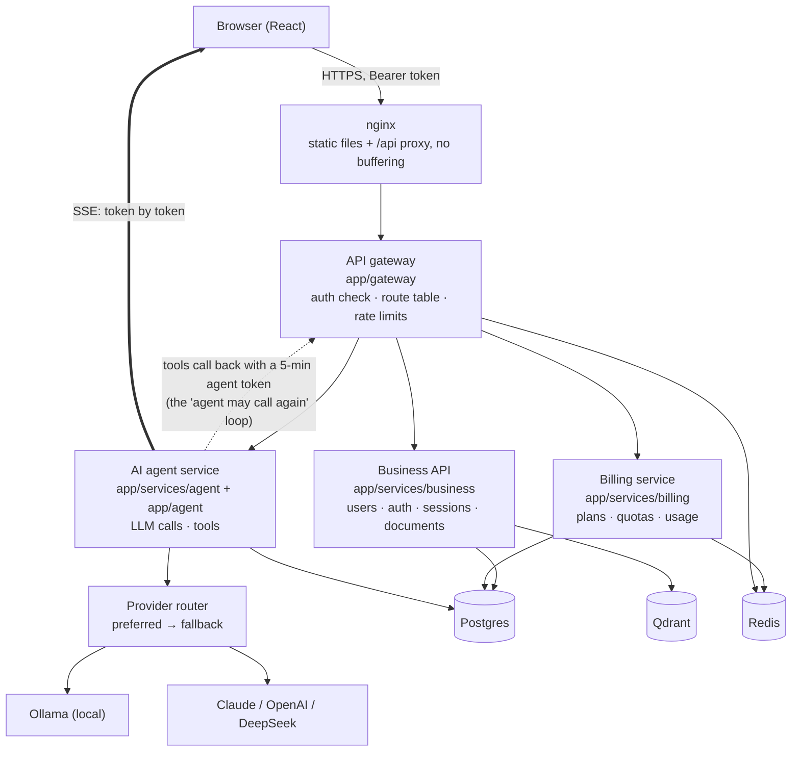
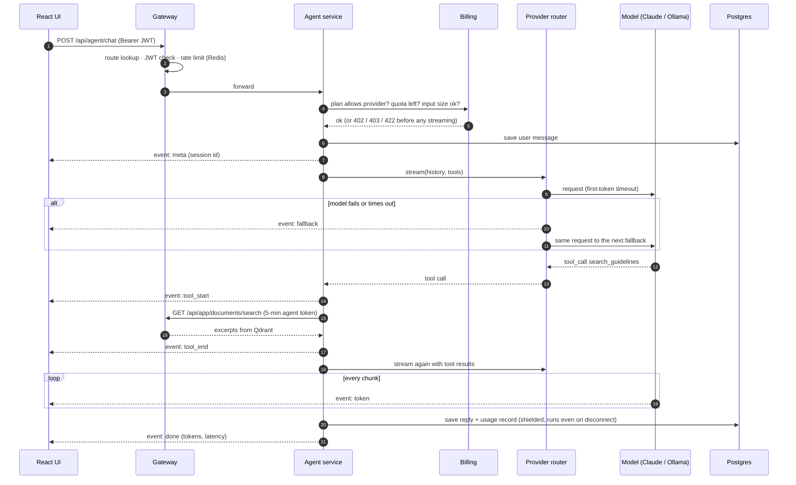
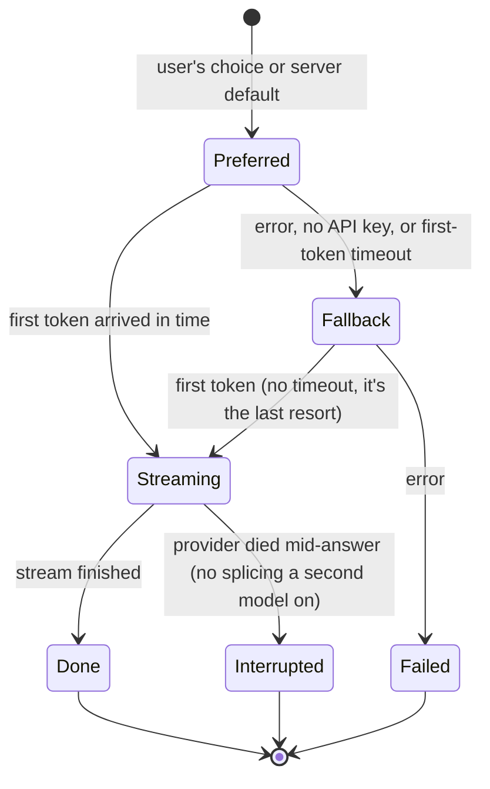
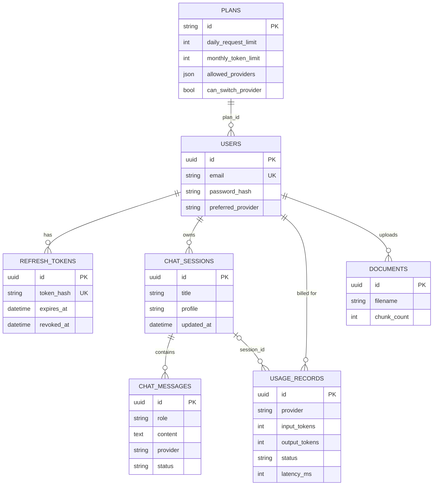

   
  
  
  
  

# Architecture

The design follows the classic GenAI SaaS diagram: a request comes in from the web client, goes through a gateway, gets handled by one of three services, which read and write the data layer, and the answer streams back to the UI. The agent can call back into the platform through the same gateway.

### Layers at a glance

| Layer | Package | Talks to | Never talks to |
| --- | --- | --- | --- |
| Web client | `frontend/src` | nginx `/api` only | anything else |
| Gateway | `app/gateway` | Redis (rate limits), the routers | the database |
| Business API | `app/services/business` | Postgres, Qdrant, embedder | providers |
| Agent service | `app/services/agent`, `app/agent` | provider router, gateway (for tools), Postgres | Qdrant directly (tools go through the gateway) |
| Billing | `app/services/billing` | Postgres, Redis | providers |

## One review, end to end

## Fallback logic

The last provider in the chain is never cut off by the first-token timeout. It has nobody to hand over to, and a cold 7B model on a CPU-only laptop can easily need longer than the cutoff just to load. It still has its own request timeout (`timeout_seconds` per provider).

## Why a modular monolith

The services are separate FastAPI routers with their own modules and no imports between each other's internals. They run in one process behind one gateway. For a product this size that gives the separation without the network hops, the extra deployments, or distributed tracing to debug a login. The gateway's route table (`app/gateway/routes.py`) is the only place that knows which prefix belongs to which service. Splitting one out later means pointing its prefix at another host.

## Request path

1. **Gateway** (`app/gateway/middleware.py`) is plain ASGI middleware, so it doesn't buffer streaming responses. For every `/api` request it:
   - matches the route table (unknown paths get a 404 here),
   - checks the JWT for non-public routes,
   - stops agent-scoped tokens from reaching anything except the two read-only endpoints the tools use,
   - counts the request against a per-user (or per-IP) fixed-window limit in Redis and adds `X-RateLimit-*` headers.

   If Redis is down it lets traffic through and logs it. That's configurable.
2. **Before streaming**, the agent endpoint does everything that can fail with a proper status code:
   - resolve the provider against the plan (403 if the plan doesn't allow it),
   - check today's requests, this month's tokens and input size (402 or 422),
   - create or load the session and save the user message.

   Only then does it return the `StreamingResponse`.
3. **The agent loop** (`app/agent/runner.py`) streams from the provider. If the model asks for a tool, it runs the tool and loops, up to `max_tool_rounds`. The last round gets no tools, so the model has to answer.
4. **The provider router** (`app/agent/providers/router.py`) tries the chosen provider. On an error, a missing key, or no first token within the timeout, it tries the next fallback in `agent.fallback_provider` (one name or an ordered list, skipping any the user's plan doesn't include) and emits a `fallback` event. If it fails after text has already streamed, it stops with an error rather than splicing a second model's answer onto the first.
5. **Bookkeeping** runs in a shielded `finally` with its own DB session. The assistant message and a usage record get written whether the stream finished, errored, or the user closed the tab. Failed requests are recorded but not billed.

## Data

| Store | What's in it |
| --- | --- |
| Postgres | plans, users, refresh tokens (hashed), sessions, messages, usage records, document metadata |
| Redis | rate-limit counters, 60 s usage snapshots for the quota check (invalidated on every write) |
| Qdrant | guideline chunks and their embeddings, filtered per user |

The collection name includes the embedding backend and dimension. Switching embedding models creates a new collection instead of corrupting the old one.

## Auth

- Passwords use PBKDF2-SHA256 with 600k iterations. Hashes get upgraded on login if the setting goes up.
- Access tokens are JWTs that last 15 minutes and are kept in memory by the frontend.
- Refresh tokens are random, stored as SHA-256 hashes, and sent as an httpOnly cookie scoped to `/api/auth`. They rotate on every use.
- Reusing an old refresh token after a 20 s grace window revokes every session for that user.
- Failed logins take the same time whether or not the email exists.
- Per-IP limits (sign-in, sign-up) use the client address nginx saw. nginx overwrites `X-Forwarded-For` with `$remote_addr` instead of appending, the gateway reads the rightmost hop, and the API port is published on `127.0.0.1` only. Together these stop a client from rotating a fake header to get around the brute-force limit.

## Health

`/api/health` runs the checks concurrently, each with a timeout: `SELECT 1` on Postgres, `PING` on Redis, listing collections on Qdrant, and a cheap endpoint on each provider (model list, tags). Provider checks are cached for 30 s, so a load balancer polling every few seconds doesn't hit paid APIs constantly.

| Condition | Status |
| --- | --- |
| Database down, or no provider usable | `down` (503) |
| Anything else broken | `degraded` (200) |
| Everything working | `ok` |

Ollama reports `degraded` when it's running but the configured model hasn't been pulled, with the exact `ollama pull` command in the detail.

## Streaming

The response is `text/event-stream` over a POST. The frontend reads it with `fetch` and a small parser (`frontend/src/api/sse.js`), because `EventSource` can't send an Authorization header or a body. nginx has `proxy_buffering off` for `/api/`, and responses carry `X-Accel-Buffering: no` in case another proxy sits in front. The Stop button aborts the fetch. The server sees the disconnect, cancels the provider call, and records the request as `cancelled`.

## Working with small local models

The agent loop is written for the model you'll actually run on a laptop, not just the well-behaved ones. Each guard came from watching `qwen2.5-coder:3b` misbehave in a live run:

| What small models do | What the runner does (`app/agent/runner.py`) |
| --- | --- |
| Write the tool call as a JSON block in the reply instead of using the tool-call field | Holds back text that could still be a tool call (starts with `{` or a code fence) and runs it as a real call if it parses. Prose is never delayed. |
| Call the same tool with the same arguments over and over | Doesn't re-run a repeat; tells the model it has the result and withdraws the tools. |
| Call a tool that wasn't offered, because the prompt mentions it | Answers "nothing to look up" and moves on to the answer. |
| Echo the JSON schema as an argument value | Tool arguments fall back to defaults instead of crashing. |
| Say nothing at all once tools are taken away | Adds a one-line "write your answer now" nudge. If the answer is still empty, that's an `empty_answer` error, not a silent success, and it isn't billed. |

Tools are also only offered when there's data behind them: no uploaded guidelines means no `search_guidelines`. On a CPU every extra round costs a minute or more.
