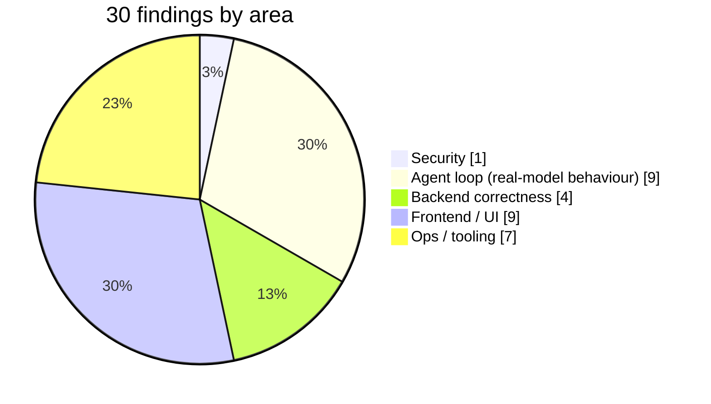

<p align="center"></p>

<p align="center">
  <br/>
  
  
  
</p>

# Code review report

Before publishing DiffSage I went through all 103 source files in full, not just a diff, looking at correctness, security, error handling, concurrency, resource management and dead code. Then I ran the whole stack against a real local model and fixed what that turned up.

## Summary

The codebase was in good shape: clear layering, a real gateway, careful streaming bookkeeping, honest tests. Reading it found **9 defects**. Running it for real against a local model on Windows found **15 more** that no unit test could, because fake models always behave and real small models don't. A later UI redesign pass found **6 more**. All **30 are fixed**, each with a regression test where one makes sense, and **2 design limits** are documented.



## Findings and fixes

| # | Severity | Area | Finding | Fix | Test |
| --- | --- | --- | --- | --- | --- |
| 1 | **High** | Security · gateway | The per-IP rate limit on sign-in/sign-up could be bypassed. nginx *appended* to `X-Forwarded-For`, the gateway trusted the **leftmost** entry (client-controlled), and the API port was published on all interfaces. Rotating a fake header gave unlimited password guesses. | nginx now overwrites the header with `$remote_addr`, the gateway reads the **rightmost** hop, and `:8000` is published on `127.0.0.1` only. | `test_client_ip_ignores_addresses_the_client_wrote_itself` |
| 2 | **High** | Agent · fallback | The first-token timeout (25 s) also applied to the **last** provider in the chain. With Ollama as both default and fallback on a CPU-only machine, a cold 7B model load killed the only provider: "None of the AI providers responded". | The last provider in the chain gets no first-token cutoff (it still has its own request timeout). | `test_last_provider_in_the_chain_is_not_cut_off_by_the_first_token_timeout` |
| 3 | **High** | Agent · Claude | `anthropic_messages` could send a conversation starting with an **assistant** turn, or with an orphaned `tool_result`, because the history window is cut by message count and error rows are filtered out. Anthropic answers that with HTTP 400. | Leading non-user and tool-result-only turns are trimmed. | `test_anthropic_messages_never_start_on_an_assistant_turn` |
| 4 | Medium | Frontend · chat | Switching to another conversation **while a review was streaming** kept the stream attached: the remaining tokens were written into the conversation you had just opened. | Navigating away aborts and detaches the stream; late events are ignored. The server still saves the partial reply as `cancelled`. | verified in the browser |
| 5 | Medium | Auth | `verify_password` base64-decoded the stored digest **outside** its `try`, so a malformed hash in the DB became a 500 on login instead of "wrong password". | Decode moved inside the guarded block. | `test_verify_password_rejects_a_hash_with_a_broken_digest` |
| 6 | Medium | Business API | `PATCH /api/app/me` indexed `PLANS[user.plan_id]` directly (KeyError → 500 for a retired plan), while everywhere else uses the safe `plan_for()`. | Uses `plan_for()`. | covered by API tests |
| 7 | Medium | Ops · compose | `ollama-pull` did `sleep 3` and then pulled with `restart: "no"`. If Ollama took longer to boot, the pull failed once and never retried, leaving the app with no model. | Waits until `ollama list` answers; `restart: on-failure:3`. | verified with `docker compose up` |
| 8 | Medium | Ops · dev | The documented "run without Docker" path couldn't work: compose never published Postgres/Redis/Qdrant ports, so `make infra` + `make dev-backend` connected to nothing. | New `docker-compose.dev.yml` publishes them on `127.0.0.1`; used by `infra`. | verified |
| 9 | Medium | CI | `ruff check` reported **26 errors** (24 line-length, plus `B904` missing `raise ... from`, `B905` `zip()` without `strict`), so the CI lint job failed as shipped. | Real issues fixed in code; line length set to 180 to match the codebase's deliberate wide style. | `ruff check`: clean |

### Found by running it end to end

These only showed up with the real stack: Postgres, Redis, Qdrant, Ollama and `qwen2.5-coder:3b` on a CPU-only laptop, driven through the UI with Playwright.

| # | Severity | Area | Finding | Fix | Test |
| --- | --- | --- | --- | --- | --- |
| 10 | **High** | Agent | Small local models **write the tool call as a JSON code block in the reply** instead of using Ollama's tool-call field. The lookup never ran and the user got raw JSON instead of a review. | While a turn's text could still be a tool call (it starts with `{` or a code fence, up to 2,000 chars) the runner holds it back; if it parses as a known tool call, it runs as a real one. Normal answers are never delayed. | `test_tool_call_written_as_text_is_run_instead_of_shown`, `test_answers_that_start_with_code_still_stream_normally` |
| 11 | **High** | Agent · streaming | A model can finish "successfully" having written **nothing** (it happened after a tool round). The stream ended with `done`, the UI showed an empty bubble, nothing was saved, and the user was **billed** for it. | An empty answer is now an `empty_answer` error the user can retry. It's saved as an error and not billed. | `test_an_empty_answer_is_an_error_not_a_silent_success` |
| 12 | Medium | Agent | The model called **the same tool with the same arguments three rounds running**. | A repeat isn't re-run; the model is told it already has the result, tools are withdrawn, and it's nudged to answer. | `test_repeating_the_same_tool_call_moves_the_model_on_to_the_answer` |
| 13 | Medium | Agent | The model passed the **JSON schema itself** as an argument (`"top_k": {"type": "integer"}`), and `int(dict)` crashed both tools. | Tool arguments are parsed defensively and fall back to defaults. | `test_tool_arguments_that_echo_the_schema_fall_back_to_defaults` |
| 14 | Medium | Agent · prompt | The system prompt said "call search_guidelines" unconditionally, so a model called it even when it wasn't offered, and the JSON leaked again. | Prompts say "if you have the tool". A withheld tool called as text gets a clean "nothing to look up" result, and the model moves on to the answer. | `test_a_withheld_tool_called_as_text_gets_a_clean_answer_not_raw_json` |
| 15 | Medium | Agent · performance | A new user with no guidelines and no past reviews was still offered both lookups. Each can only return nothing, and each costs a full model round (a minute or more on a laptop CPU). | Tools are offered only when there's data behind them. | `test_tools_with_nothing_behind_them_are_not_offered` |
| 16 | Medium | Error handling | With Postgres gone, the API returned a generic **500** instead of 503, and the error **lost its request id**. asyncpg raises `socket.gaierror` unwrapped, and the catch-all handler ran after the request context was cleared. | Network-level errors map to 503 `service_unavailable`. Unhandled errors are answered inside the request context, so the body, the `X-Request-ID` header and the log line share one id. | `test_unresolvable_database_host_is_a_503_not_a_500`, `test_unexpected_errors_keep_their_request_id` |
| 17 | Medium | Ops · Ollama | Ollama unloads idle models after **5 minutes**, and loading `qwen2.5-coder:3b` from disk took **~2 minutes** here, so every returning user paid that again. The **4k default context** also silently truncates a 12k-character review plus prompt. | `OLLAMA_KEEP_ALIVE=24h`, `OLLAMA_CONTEXT_LENGTH=8192`, and `ollama-pull` warms the chat model after pulling. | verified: warm-up logged, no reload between reviews |
| 18 | Medium | Ops · Ollama | Ollama's 180 s request timeout fired **before the first token** on a long prompt under CPU load. | 600 s for Ollama: it's the last resort, so slow beats failed. | verified live |
| 19 | Medium | Ops · Windows | Port **8080** was already taken on the test machine (a Windows service), so the web container couldn't start. | `WEB_PORT` in `.env` (default 8080); the script and docs use it. | verified on 8088 |
| 20 | Low | UI | Session titles came out as a code fence ("```diff") when the paste started with one. | Titles skip fence lines. | `test_title_skips_code_fences` |
| 21 | Low | UI | Models write `**[major]**` (bold), which missed the severity gutter. | The pattern accepts bold and a trailing colon. | `recognises bolded tags the way small models write them` |
| 22 | Low | UI | The chat header said "Answering with Claude" after Claude's key had been removed; reviews actually fell back to Ollama. | Shows the model that will really answer. | verified in the browser |
| 23 | Low | UI | With a peak of 1, the chart's axis ticks were `0, 1, 1` (a duplicate label and duplicate React keys). | Ticks are de-duplicated. | verified in the browser |
| 24 | Low | UI | `THREE.Clock` is deprecated in three.js r18x (console warning). | Plain `performance.now()` delta. | console clean |

### Found during the UI redesign pass

The redesign (see [design.md](design.md)) was checked screen by screen with screenshots, and that turned up these:

| # | Severity | Area | Finding | Fix | Test |
| --- | --- | --- | --- | --- | --- |
| 25 | Medium | UI · settings | A saved model that later lost its API key showed as **selected and disabled at once**, so no usable option looked chosen and nothing explained why. | Shows the server default as active, with a notice saying the saved choice isn't available and how to fix it. | verified in the browser |
| 26 | Medium | UI · auth | Signing out kept the URL on the **previous user's** review, so the next account to sign in landed on "That conversation doesn't exist". | Signing out goes home. | verified in the browser |
| 27 | Medium | Backend · streaming | A stream stopped before its first token saved **no reply row**, so the history showed a question with nothing after it. | A cancelled reply is always saved (empty if need be) and shown as "Stopped before it wrote anything". | `test_a_stream_stopped_before_any_text_still_leaves_a_reply_row` |
| 28 | Medium | Agent | A lookup with a malformed query returned its error as normal text, so the UI showed it as a **successful** search. | It's raised and reported as a failed lookup. | `test_a_lookup_with_a_malformed_query_is_reported_as_failed` |
| 29 | Low | Frontend | `App.jsx` had been saved as Windows-1252 by an earlier edit script, so the loading text's "…" was a broken byte. | Re-encoded as UTF-8; the whole tree was scanned and it was the only file. | UTF-8 scan of every file |
| 30 | Low | Ops · Windows | Port **8000** was taken on the test machine by another local project, so the API couldn't publish. | `API_PORT` in `.env` (default 8000); the script's health checks follow it. | verified on 8001 |

Also changed as part of the review:

- nginx `client_max_body_size` raised from 1 MB to 2 MB. A 200k-character upload can exceed 1 MB once JSON-escaped (quotes, newlines, multi-byte UTF-8).
- Windows support: `make` doesn't exist on Windows, so `diffsage.ps1` provides every task (setup, up, down, logs, health, infra, deps, dev, test, lint) and works on Windows PowerShell 5.1.

## Documented limits (not bugs, but worth knowing)

| Limit | Why it's acceptable for now | Upgrade path |
| --- | --- | --- |
| The daily quota is checked when a request starts and recorded when it ends, so simultaneous streams can overshoot by a few requests. | The agent rate limit (20/min per user) bounds the overshoot. | Reserve a "pending" usage row, or an atomic Redis counter, at request start. |
| Two tabs refreshing the same session in the same second: the second tab gets signed out (refresh token rotation). | Rare; within the 20 s grace window it does *not* revoke every session. | Return the already-rotated token during the grace window. |

## What was checked and found solid

- **Gateway:** pure ASGI (no `BaseHTTPMiddleware` streaming bugs), deny-by-default route table, agent tokens limited to two read-only endpoints.
- **Auth:** PBKDF2 600k with transparent rehash, constant-time login for unknown emails, hashed rotating refresh tokens with reuse detection, httpOnly cookie scoped to `/api/auth`.
- **Streaming:** every refusal (402/403/422) happens before the stream opens. Bookkeeping runs in an `anyio`-shielded `finally`, so usage is written even when the tab closes.
- **Providers:** raw HTTP adapters with pure, unit-tested wire parsers. Registry auto-discovery means a new provider is one file.
- **Markdown rendering:** builds React elements (no `innerHTML`); links are limited to `http(s)`.
- **Vector store:** every point carries `user_id` and every search filters on it; collections are namespaced by embedding dimension.
- **Config:** production refuses placeholder secrets and default DB credentials.

## End-to-end verification

Run on Windows 11 (i7-1165G7, 16 GB, no discrete GPU) with Docker Desktop and `OLLAMA_MODEL=qwen2.5-coder:3b`.

| Check | Result |
| --- | --- |
| `docker compose up` from scratch | 7 containers start, migrations run on real Postgres, `ollama-pull` waits for the server, pulls both models and warms the chat model |
| Health check reflects real state | `ok` with everything up. Stopping Ollama with a bad Claude key gives **503 `down`**. Stopping Redis marks `cache: down` (non-critical) while the API keeps serving (fail-open). Stopping Postgres gives **503**, database `down`. An invalid Anthropic key shows `anthropic: down, "API key rejected"` |
| Auth → dashboard → chat in the browser | Register, token refresh, the dashboard with real counts, the chat and settings all work through nginx on the same origin |
| Streaming is really streaming | Sampled once a second in the browser: the reply grew 12 → 58 → 102 → … → 696 characters over ~6 minutes. The SSE capture shows 224 separate `token` events |
| Provider switching | Pro unlocks the model section; choosing Claude is saved; health status shows per model |
| Fallback to Ollama | With an invalid Claude key, Anthropic's 401 triggered fallback **within 1 second**, and the UI said why. Ollama then streamed the answer |
| Every provider down | The stream sends `fallback`, then `providers_unavailable` with each attempt and its reason; nothing crashes |
| Stop button | Stops the stream; the server saves the partial reply as `cancelled` and records usage |
| RAG | Uploading `STYLE.md` indexed it with real `nomic-embed-text` embeddings into Qdrant; a semantic search returned the right section |
| Agent calls back through the gateway | A 5-minute agent-scoped token fetched guidelines through the real gateway over HTTP, and was **blocked with 403** on `/api/app/me` and `/api/billing/plan` |
| Error paths keep request ids | The Postgres-down 503 carried the caller's `X-Request-ID` in the body and the header |
| Mobile (390 px) | No horizontal overflow on chat or dashboard; the nav collapses to icons |
| Tests / lint | 121 backend + 9 frontend tests passing; `ruff` clean; production build OK |

**About speed on this machine:** a 4-core laptop CPU running Ollama inside Docker's WSL VM manages about **1–3 tokens/s** with a 3B model. So a review takes minutes, streaming the whole time. That's the hardware, not the app: the same flow with a Claude, OpenAI or DeepSeek key, or an NVIDIA GPU, runs at normal speed.
