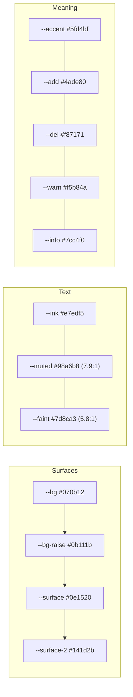

   
  
  
  

# Design system

How the UI looks and why, so the next change stays consistent with the last one. Everything lives in one stylesheet, `frontend/src/styles.css`; there's no CSS framework.

## Principles

1. **The review is the loudest thing on screen.** Chrome stays quiet so the severity gutter and the diff view carry the page.
2. **One accent.** A desaturated sage (`#5fd4bf`) marks actions, focus and "you are here". Nothing else competes with it.
3. **Colour means something.** Green and red are for added and removed lines. Amber and sky only mark `major` and `minor`. Violet appears only in the logo gem and the 3D crystal's rim light.
4. **Spend the boldness in one place.** The 3D moments are few and deliberate: the crystal on sign-in, the isometric usage chart, and a gentle tilt on the cards you choose from (sign-in, plans). Everything else stays still.
5. **Every screen has its states.** Loading shows skeletons shaped like the content. Empty screens say what to do next. Errors say what happened and how to fix it.

## Tokens

| Group | Values | Rule |
| --- | --- | --- |
| Surfaces | `--bg` → `--bg-raise` → `--surface` → `--surface-2` | One cool-navy family, lighter as things come forward. No neutral greys mixed in. |
| Text | `--ink`, `--muted`, `--faint` | Every text colour passes WCAG AA (4.5:1) on every surface it sits on. |
| Radius | 6 / 9 / 13 / 18 px | Tight on small parts (buttons, tags), softer on containers (cards, composer). |
| Shadows | `--shadow-1`, `--shadow-2` | Tinted navy, light from above; never plain black. |
| Motion | `--ease`, `--spring` | Transform and opacity only. Everything stops under `prefers-reduced-motion`. |

## Type

- **Geist** for the interface: 650 weight and tight tracking for headlines, 400/500 for body and controls.
- **Geist Mono** only for code, diffs and model IDs (`qwen2.5-coder:3b`), where monospace carries meaning.
- Sentence case everywhere; no all-caps labels. Headings use `text-wrap: balance`, paragraphs `text-wrap: pretty`, and numbers use tabular figures.

## Components worth knowing

| Component | Where | Notes |
| --- | --- | --- |
| Severity gutter | `components/Markdown.jsx` | `[blocker]` / `[major]` / `[minor]` / `[nit]` at the start of a bullet (bold or not) becomes a coloured gutter. |
| Diff view | `components/Markdown.jsx` | `+`/`-` lines get add/remove washes and a marked gutter; unfinished code fences render open while streaming. |
| Crystal | `components/HeroScene.jsx` | three.js, lazy-loaded, pauses in hidden tabs, frees GPU memory on unmount, falls back to a CSS orb without WebGL. |
| Tilt card | `components/TiltCard.jsx`, `lib/tilt.js` | Leans toward the pointer with a lit edge; off on touch screens and under reduced motion. |
| Isometric chart | `components/UsageChart.jsx` | Plain SVG (front, side and top faces), today's bar in the brighter accent. |
| Starters | `pages/Chat.jsx` | Examples as a short list, not a row of three identical cards. |

## Accessibility checklist (all passing)

- Skip link to the main content; visible focus ring on everything focusable.
- Icon-only buttons have labels; decorative icons are `aria-hidden`.
- Form errors appear inline, next to the field, with `aria-invalid` and a description.
- The streaming reply sits in an `aria-live` region and is marked `aria-busy` while writing.
- Touch targets are at least 40 px; no horizontal scrolling at 390 px wide.
- No `window.alert` or `confirm`: removing a file asks inline.

## How this was made

The redesign pass followed the local design skills in `~/.claude`, applied in order:
1. **`ui-ux-pro-max`** for the design-system query, contrast and the pre-delivery checklist.
2. **`taste-skill:redesign-skill`** to audit the old UI: the two-colour "AI gradient", all-caps labels, three identical cards, motion on every card, missing states.
3. **`frontend-design`** for the plan-then-critique loop: one memorable element, restraint everywhere else, and screenshots reviewed after every change.
