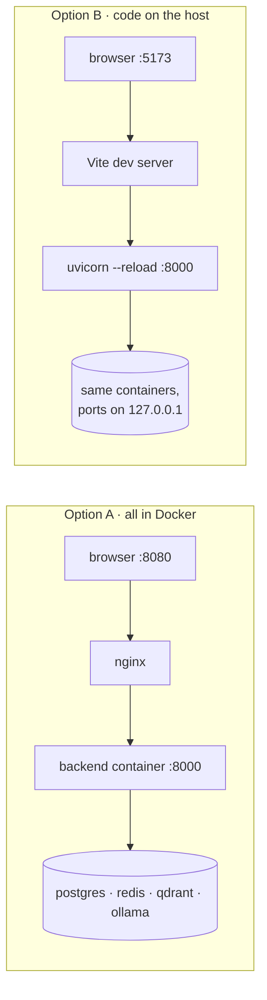

<p align="center"></p>

<p align="center">
  <br/>
  
  
</p>

# Running DiffSage on Windows

Two ways to run it:

| | Option A: everything in Docker | Option B: code on the host |
| --- | --- | --- |
| For | trying it, demos, "does it work" | changing the code with hot reload |
| Needs | Docker Desktop | Docker Desktop + Python 3.11+ + Node 22 |
| Command | `.\diffsage.ps1 up` | `infra`, then `dev-backend` + `dev-frontend` |
| Open | http://localhost:8080 | http://localhost:5173 |



## 0. Prerequisites

1. **Docker Desktop** from https://www.docker.com/products/docker-desktop/. Keep the WSL 2 backend (the default). Start it and wait for "Engine running".
2. In Docker Desktop → Settings → Resources, give it **at least 6 GB of memory** (8 GB is comfortable). The local model lives in that memory.
3. About **8 GB free disk** for images and models.
4. For option B only: **Python 3.11+** (python.org, tick "Add python.exe to PATH") and **Node 22 LTS** (nodejs.org).

Check from PowerShell:

```powershell
docker --version
docker compose version
python --version   # option B only
node --version     # option B only
```

## 1. Get the code

```powershell
git clone https://github.com/asadaslam556/diffsage.git
cd diffsage
```

(Or unzip `diffsage.zip` and `cd` into the folder.)

Allow local scripts for your user once:

```powershell
Set-ExecutionPolicy -Scope CurrentUser RemoteSigned
```

If your organisation blocks that, prefix every command with `powershell -ExecutionPolicy Bypass -File`, for example `powershell -ExecutionPolicy Bypass -File .\diffsage.ps1 up`.

## 2. Configure

```powershell
.\diffsage.ps1 setup
notepad .env
```

`setup` copies `.env.example` to `.env` and puts a random 64-character `JWT_SECRET` in it. Things you might change in `.env`:

| Line | Why |
| --- | --- |
| `OLLAMA_MODEL=qwen2.5-coder:3b` | **Recommended on laptops without an NVIDIA GPU.** The 7B default is better but slow on CPU. |
| `ANTHROPIC_API_KEY=` / `OPENAI_API_KEY=` / `DEEPSEEK_API_KEY=` | Turn on paid models. Leave empty and they show as "No API key". |
| `AGENT__DEFAULT_PROVIDER=anthropic` | Make a paid model the default for everyone. Ollama stays the fallback. |
| `OLLAMA_BASE_URL=http://host.docker.internal:11434` | Use an Ollama you already run on Windows instead of the container. |

## 3A. Run everything in Docker

```powershell
.\diffsage.ps1 up
```

This builds the images, starts seven containers, waits for the API, and opens http://localhost:8080. On the very first run `ollama-pull` downloads the models (about 2 GB for the 3B model, 5 GB for 7B), so give it a few minutes. Watch it with:

```powershell
docker compose logs -f ollama-pull
```

Check every component:

```powershell
.\diffsage.ps1 health
```

You want `"status": "ok"`. `"degraded"` with `ollama ... isn't pulled` means the model download hasn't finished yet.

Stop it (your data stays in Docker volumes):

```powershell
.\diffsage.ps1 down
```

Wipe everything including accounts and models:

```powershell
docker compose down -v
```

## 3B. Run the code on the host (hot reload)

```powershell
.\diffsage.ps1 deps            # venv + pip install, npm install (once)
.\diffsage.ps1 infra           # postgres, redis, qdrant, ollama in Docker, ports on 127.0.0.1
```

Then two terminals:

```powershell
# terminal 1: API on :8000, runs migrations first
.\diffsage.ps1 dev-backend
```

```powershell
# terminal 2: UI on :5173, proxies /api to :8000
.\diffsage.ps1 dev-frontend
```

Open http://localhost:5173.

## 4. Try the whole flow

1. Create an account. You start on Free (25 reviews a day, local model).
2. Click the **Review a diff** starter card, then **Review**. Tokens stream in, and you may see "Searched your guidelines" first.
3. Settings → Team guidelines → upload any `.md` style guide. Ask for a review again; it cites the file.
4. Settings → Plan → **Switch to Pro**. The Model section unlocks. Pick Claude (if you set a key) and send a review. Put a wrong key in `.env` to watch it fall back to Ollama with a notice.
5. The Usage page shows today's count, monthly tokens, a 14-day 3D chart and the request history.

## 5. Tests

```powershell
.\diffsage.ps1 test   # 121 backend + 9 frontend tests, no Docker needed
.\diffsage.ps1 lint
```

## Troubleshooting

| Symptom | Fix |
| --- | --- |
| `running scripts is disabled on this system` | `Set-ExecutionPolicy -Scope CurrentUser RemoteSigned`, or use `powershell -ExecutionPolicy Bypass -File .\diffsage.ps1 up`. |
| `error during connect ... docker_engine` | Docker Desktop isn't running. Start it and wait for "Engine running". |
| Reviews say "None of the AI providers responded" | The model isn't downloaded yet (`docker compose logs ollama-pull`), or Docker has too little memory. Check `.\diffsage.ps1 health`. |
| Reviews are very slow | You're on CPU with a 7B model. Set `OLLAMA_MODEL=qwen2.5-coder:3b` in `.env`, then `.\diffsage.ps1 up`. |
| Port 8080 or 8000 already in use (`ports are not available`) | Put `WEB_PORT=8088` and/or `API_PORT=8001` (any free ports) in `.env` and run `up` again. For 11434, change the host port (the middle number in `127.0.0.1:11434:11434`) in `docker-compose.yml`. |
| Uploading a guideline fails with "Couldn't index the file" | `nomic-embed-text` isn't pulled yet. Wait for `ollama-pull` to finish. |
| `dev-backend` can't reach the database | Run `.\diffsage.ps1 infra` first. It publishes Postgres/Redis/Qdrant on `127.0.0.1`. |
| Signed out after restarting the backend | Expected if `JWT_SECRET` is empty (a random one is used per process). `.\diffsage.ps1 setup` sets a stable one. |
